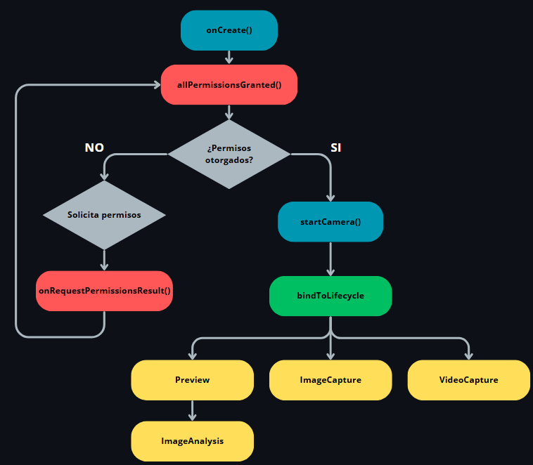

# 📸 CameraX Application with Java - Documentation

Implementation of CameraX using Java

## 📁 Table of Contents

This project is a fully documented guide and reference code for using CameraX in Java.
It includes step-by-step explanations, lifecycle-based implementation and examples .

1. 🎯 Project Creation and Initialization
2. 🚀 App Logic - MainActivity and Use Cases
3. 📚 Additional Resources

---

## 🎯 Project Creation and Initialization

### 🛠️ Creating a New Project in Android Studio

1. Open **Android Studio**.
2. Select `File > New > New Project`.
3. Choose the **Empty Activity** template.
4. Set the project name (e.g., `CameraXApplication`).
5. Choose **Java** as the language.
6. Set the **Minimum SDK** to `API 21: Lollipop`.
7. Click **Finish** to create the project.

### 📦 Required Dependencies

Add the following dependencies to your `app/build.gradle` file under the `dependencies` block:

```gradle
implementation "androidx.camera:camera-core:1.3.0"
implementation "androidx.camera:camera-camera2:1.3.0"
implementation "androidx.camera:camera-lifecycle:1.3.0"
implementation "androidx.camera:camera-view:1.3.0"
implementation "androidx.camera:camera-extensions:1.3.0"
implementation "androidx.camera:camera-video:1.3.0"
```

These libraries represent the core CameraX components for preview, capture, lifecycle management, view rendering, and video features.

### 🔐 Permissions

Add the following lines to your `AndroidManifest.xml` file within the `<manifest>` tag:

```xml
<uses-feature android:name="android.hardware.camera" android:required="false" />
<uses-permission android:name="android.permission.CAMERA" />
<uses-permission android:name="android.permission.READ_MEDIA_IMAGES" />
<uses-permission android:name="android.permission.RECORD_AUDIO" />
```

These permissions and features are required for camera access, media storage, and audio recording for video capture.

### 🎨 Layout

Replace the contents of `res/layout/activity_main.xml` with the following layout configuration:

```xml
<?xml version="1.0" encoding="utf-8"?>
<androidx.constraintlayout.widget.ConstraintLayout
    xmlns:android="http://schemas.android.com/apk/res/android"
    xmlns:app="http://schemas.android.com/apk/res-auto"
    android:layout_width="match_parent"
    android:layout_height="match_parent">

    <androidx.camera.view.PreviewView
        android:id="@+id/previewView"
        android:layout_width="0dp"
        android:layout_height="0dp"
        app:layout_constraintTop_toTopOf="parent"
        app:layout_constraintBottom_toBottomOf="parent"
        app:layout_constraintStart_toStartOf="parent"
        app:layout_constraintEnd_toEndOf="parent" />

    <Button
        android:id="@+id/captureButton"
        android:layout_width="wrap_content"
        android:layout_height="wrap_content"
        android:text="📸 Capture"
        app:layout_constraintBottom_toTopOf="@id/videoButton"
        app:layout_constraintStart_toStartOf="parent"
        app:layout_constraintEnd_toEndOf="parent"
        android:layout_marginBottom="16dp"/>

    <Button
        android:id="@+id/videoButton"
        android:layout_width="wrap_content"
        android:layout_height="wrap_content"
        android:text="🎥 Record"
        app:layout_constraintBottom_toBottomOf="parent"
        app:layout_constraintStart_toStartOf="parent"
        app:layout_constraintEnd_toEndOf="parent"
        android:layout_marginBottom="32dp"/>
</androidx.constraintlayout.widget.ConstraintLayout>
```

### 🧠 MainActivity

Replace the contents of `MainActivity.java` with the next code:

```java
package com.example.cameraxapplication;

import android.Manifest;
import android.content.ContentValues;
import android.content.pm.PackageManager;
import android.net.Uri;
import android.os.Bundle;
import android.provider.MediaStore;
import android.util.Log;
import android.view.View;
import android.widget.Button;
import android.widget.Toast;
import androidx.annotation.NonNull;
import androidx.appcompat.app.AppCompatActivity;
import androidx.camera.core.CameraSelector;
import androidx.camera.core.ImageAnalysis;
import androidx.camera.core.ImageCapture;
import androidx.camera.core.ImageCaptureException;
import androidx.camera.core.ImageProxy;
import androidx.camera.core.Preview;
import androidx.camera.lifecycle.ProcessCameraProvider;
import androidx.camera.video.FallbackStrategy;
import androidx.camera.video.MediaStoreOutputOptions;
import androidx.camera.video.PendingRecording;
import androidx.camera.video.Quality;
import androidx.camera.video.QualitySelector;
import androidx.camera.video.Recorder;
import androidx.camera.video.Recording;
import androidx.camera.video.VideoCapture;
import androidx.camera.video.VideoRecordEvent;
import androidx.camera.view.PreviewView;
import androidx.core.app.ActivityCompat;
import androidx.core.content.ContextCompat;
import com.google.common.util.concurrent.ListenableFuture;
import java.io.File;
import java.nio.ByteBuffer;
import java.text.SimpleDateFormat;
import java.util.Date;
import java.util.Locale;
import java.util.concurrent.ExecutionException;
import java.util.concurrent.Executor;
import java.util.concurrent.ExecutorService;
import java.util.concurrent.Executors;

public class MainActivity extends AppCompatActivity {

    // Constants
    private static final int REQUEST_CODE_PERMISSIONS = 10;
    private static final String[] REQUIRED_PERMISSIONS = new String[]{
            Manifest.permission.CAMERA,
            Manifest.permission.RECORD_AUDIO
    };
    private static final String TAG = "CameraXApp";

    // CameraX Components
    private PreviewView previewView;
    private ImageCapture imageCapture;
    private VideoCapture<Recorder> videoCapture;
    private Recording recording;

    @Override
    protected void onCreate(Bundle savedInstanceState) {
        super.onCreate(savedInstanceState);
        setContentView(R.layout.activity_main);

        previewView = findViewById(R.id.previewView);
        Button captureButton = findViewById(R.id.captureButton);
        Button videoButton = findViewById(R.id.videoButton);

        if (allPermissionsGranted()) {
            startCamera();
        } else {
            ActivityCompat.requestPermissions(this, REQUIRED_PERMISSIONS, REQUEST_CODE_PERMISSIONS);
        }

        captureButton.setOnClickListener(v -> takePhoto());

        videoButton.setOnClickListener(v -> {
            if (recording != null) {
                recording.stop();
                recording = null;
                videoButton.setText("🎥 Record");
            } else {
                startRecording(videoButton);
            }
        });
    }

    /**
     * Initializes and binds CameraX use cases to the lifecycle.
     */
    private void startCamera() {
        ListenableFuture<ProcessCameraProvider> cameraProviderFuture = ProcessCameraProvider.getInstance(this);

        cameraProviderFuture.addListener(() -> {
            try {
                ProcessCameraProvider cameraProvider = cameraProviderFuture.get();

                // Preview use case
                Preview preview = new Preview.Builder().build();
                preview.setSurfaceProvider(previewView.getSurfaceProvider());

                // ImageCapture use case
                imageCapture = new ImageCapture.Builder().build();

                // VideoCapture use case
                Recorder recorder = new Recorder.Builder()
                        .setQualitySelector(QualitySelector.from(
                                Quality.HD,
                                FallbackStrategy.lowerQualityOrHigherThan(Quality.SD)))
                        .build();
                videoCapture = VideoCapture.withOutput(recorder);

                // ImageAnalysis use case
                ImageAnalysis imageAnalysis = new ImageAnalysis.Builder()
                        .setBackpressureStrategy(ImageAnalysis.STRATEGY_KEEP_ONLY_LATEST)
                        .build();
                imageAnalysis.setAnalyzer(getExecutor(), new LuminosityAnalyzer());

                CameraSelector cameraSelector = new CameraSelector.Builder()
                        .requireLensFacing(CameraSelector.LENS_FACING_BACK)
                        .build();

                cameraProvider.unbindAll();
                cameraProvider.bindToLifecycle(this, cameraSelector, preview, imageCapture, videoCapture, imageAnalysis);

            } catch (Exception e) {
                Log.e(TAG, "Camera initialization failed", e);
            }
        }, getExecutor());
    }

    /**
     * Captures a photo and saves it to local storage.
     */
    private void takePhoto() {
        if (imageCapture == null) return;

        File photoFile = new File(getExternalFilesDir(null),
                new SimpleDateFormat("yyyy-MM-dd-HH-mm-ss-SSS", Locale.US)
                        .format(new Date()) + ".jpg");

        ImageCapture.OutputFileOptions outputOptions =
                new ImageCapture.OutputFileOptions.Builder(photoFile).build();

        imageCapture.takePicture(outputOptions, getExecutor(), new ImageCapture.OnImageSavedCallback() {
            @Override
            public void onImageSaved(@NonNull ImageCapture.OutputFileResults outputFileResults) {
                String msg = "Photo saved: " + photoFile.getAbsolutePath();
                Toast.makeText(getBaseContext(), msg, Toast.LENGTH_SHORT).show();
                Log.d(TAG, msg);
            }

            @Override
            public void onError(@NonNull ImageCaptureException exception) {
                Log.e(TAG, "Photo capture failed: ", exception);
            }
        });
    }

    /**
     * Starts or stops video recording depending on the current state.
     */
    private void startRecording(Button videoButton) {
        if (videoCapture == null) return;

        if (ContextCompat.checkSelfPermission(this, Manifest.permission.RECORD_AUDIO)
                != PackageManager.PERMISSION_GRANTED) {
            ActivityCompat.requestPermissions(this,
                    new String[]{Manifest.permission.RECORD_AUDIO},
                    REQUEST_CODE_PERMISSIONS);
            return;
        }

        String fileName = new SimpleDateFormat("yyyy-MM-dd-HH-mm-ss", Locale.US)
                .format(new Date());

        ContentValues contentValues = new ContentValues();
        contentValues.put(MediaStore.MediaColumns.DISPLAY_NAME, fileName);
        contentValues.put(MediaStore.MediaColumns.MIME_TYPE, "video/mp4");

        MediaStoreOutputOptions outputOptions = new MediaStoreOutputOptions.Builder(
                getContentResolver(), MediaStore.Video.Media.EXTERNAL_CONTENT_URI)
                .setContentValues(contentValues)
                .build();

        PendingRecording pendingRecording = videoCapture.getOutput()
                .prepareRecording(this, outputOptions)
                .withAudioEnabled();

        recording = pendingRecording.start(getExecutor(), videoRecordEvent -> {
            if (videoRecordEvent instanceof VideoRecordEvent.Finalize) {
                Uri uri = ((VideoRecordEvent.Finalize) videoRecordEvent).getOutputResults().getOutputUri();
                String msg = "Video saved: " + uri;
                Toast.makeText(this, msg, Toast.LENGTH_SHORT).show();
                Log.d(TAG, msg);
            }
        });

        videoButton.setText("⏹️ Stop");
    }

    /**
     * Analyzer for measuring average brightness (luminance) from camera frames.
     */
    public static class LuminosityAnalyzer implements ImageAnalysis.Analyzer {
        private static final String TAG = "LuminosityAnalyzer";

        @Override
        public void analyze(@NonNull ImageProxy image) {
            ByteBuffer buffer = image.getPlanes()[0].getBuffer();
            byte[] data = new byte[buffer.remaining()];
            buffer.get(data);

            int sum = 0;
            for (byte b : data) {
                sum += (b & 0xFF);
            }

            double luma = sum / (double) data.length;
            Log.d(TAG, "Average brightness: " + luma);
            image.close();
        }
    }

    private Executor getExecutor() {
        return ContextCompat.getMainExecutor(this);
    }

    /**
     * Checks if all required permissions are granted.
     */
    private boolean allPermissionsGranted() {
        for (String permission : REQUIRED_PERMISSIONS) {
            if (ContextCompat.checkSelfPermission(this, permission)
                    != PackageManager.PERMISSION_GRANTED) {
                return false;
            }
        }
        return true;
    }

    /**
     * Handles user response to runtime permission requests.
     */
    @Override
    public void onRequestPermissionsResult(int requestCode,
                                           @NonNull String[] permissions,
                                           @NonNull int[] grantResults) {
        super.onRequestPermissionsResult(requestCode, permissions, grantResults);
        if (requestCode == REQUEST_CODE_PERMISSIONS) {
            if (allPermissionsGranted()) {
                startCamera();
            } else {
                Toast.makeText(this, "Permissions not granted by the user.", Toast.LENGTH_SHORT).show();
                finish();
            }
        }
    }
}
```

---

## 🚀 App Logic - MainActivity and Use Cases

### ✅ Key Methods in MainActivity

The `MainActivity` class contains **7 main methods** that control the application's flow:

- `onCreate`
- `startCamera`
- `takePhoto`
- `startRecording`
- `LuminosityAnalyzer` (inner class with `analyze` method)
- `allPermissionsGranted`
- `onRequestPermissionsResult`

### 🔁 General Application Flow

#### 1. `onCreate()`

- Entry point of the activity.
- Initializes the layout (`activity_main.xml`) and photo/video buttons.
- Checks if permissions have been granted using `allPermissionsGranted()`.
- If permissions are missing, requests them.
- If granted, calls `startCamera()` to start the camera.

#### 2. `startCamera()`

Sets up and manages the CameraX **use cases**. These include:

| Use Case         | Description |
|------------------|-------------|
| `Preview`         | Displays the camera feed on screen. |
| `ImageCapture`    | Allows taking photos. |
| `VideoCapture`    | Allows recording videos. |
| `ImageAnalysis`   | Enables real-time image analysis (e.g., luminosity). |

Additionally:
- Retrieves an instance of `ProcessCameraProvider` to manage the camera lifecycle.
- Binds the use cases to the activity lifecycle using `bindToLifecycle(...)`.

#### ⤵️ Diagram



### 📸 Methods Executing the Use Cases

#### `takePhoto()`
- Related to the **ImageCapture** use case.
- Captures a photo and saves it as a local file.
- Uses `ImageCapture.takePicture(...)`.
- Shows a confirmation message with `Toast` and `Log`.

#### `startRecording()`
- Related to the **VideoCapture** use case.
- Starts or stops video recording with audio.
- Uses `Recorder.prepareRecording().start(...)`.
- On finish, saves the file and notifies the user.

#### `LuminosityAnalyzer()`
- Related to the **ImageAnalysis** use case.
- Accesses the Y-plane of the image (`YUV` format).
- Calculates the **average luminosity** of the frame.
- Logs the value to Logcat.
- Can be extended for object detection, QR codes, etc.

### 🔐 Permission Handling

#### `allPermissionsGranted()`
- Checks whether all required permissions have been granted.

#### `onRequestPermissionsResult(...)`
- Called when the user responds to the permissions request dialog.
- If granted, starts the camera.
- If denied, shows a message and closes the app.

### 🧠 Final Summary

This app is built using CameraX and takes advantage of its main features through a modular and lifecycle-aware approach — ideal for those wanting to learn how to work with the camera in Android.

#### 🗺️ Conceptual Map

| Use Case         | Related Method          | Main Function                          |
|------------------|-------------------------|----------------------------------------|
| Preview           | Inside `startCamera`     | Display the camera preview             |
| ImageCapture      | `takePhoto()`            | Capture and save photos                |
| VideoCapture      | `startRecording()`       | Record and save videos                 |
| ImageAnalysis     | `LuminosityAnalyzer`     | Analyze each frame (e.g., luminosity)  |

---

### 📚 Additional Resources

- 📖 [Official CameraX Documentation (Android Developers)](https://developer.android.com/media/camera/camerax)
